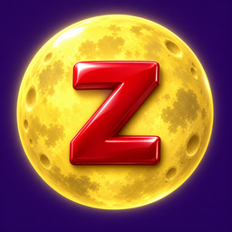

<a id="top"></a>

<p align="center">
  
</p>

<h1 align="center">Zotero Moonlight</h1>

<p align="center">
  <strong>논문 관리는 Zotero에서, 논문 읽기는 Moonlight에서.</strong><br>
  로컬 PDF 첨부 없이도 논문 URL과 DOI로 Moonlight를 엽니다.
</p>

<p align="center">
  <a href="../dist/zotero-moonlight-0.2.1.xpi?raw=true"></a>
  
  
  
</p>

<p align="center">
  <a href="../dist/zotero-moonlight-0.2.1.xpi?raw=true"><strong>플러그인 다운로드 · v0.2.1</strong></a>
  &nbsp;·&nbsp; <a href="#quick-start">빠른 시작</a>
  &nbsp;·&nbsp; <a href="../README.md">English</a>
  &nbsp;·&nbsp; <a href="#questions">자주 묻는 질문</a>
</p>

---

## 소개

Zotero에서 고른 논문을 **Zotero 내부 탭** 또는 **Chrome / Edge**에서 열어 Moonlight로 읽습니다.

직접 PDF 링크와 arXiv 주소는 온라인 PDF로 연결하고, 일반 논문 페이지와 DOI에서는 명시된 PDF 링크를 찾습니다. 이미 읽던 Moonlight 문서가 있다면 그 주소를 Zotero 논문에 직접 연결할 수도 있습니다.

**논문 선택 → 온라인 PDF 주소 확인 → Moonlight에서 읽기**

> [!NOTE]
> 비공식 연동 플러그인입니다. 로그인·구독·AI 기능은 Moonlight가 처리하며, 별도 API 키는 필요하지 않습니다. **Zotero 내부 탭 모드는 Chrome 확장 프로그램 없이 사용할 수 있습니다.**

<p align="center">
  <a href="#features">주요 기능</a> &nbsp;·&nbsp;
  <a href="#quick-start">설치</a> &nbsp;·&nbsp;
  <a href="#reading-modes">열기 방식</a> &nbsp;·&nbsp;
  <a href="#everyday-use">사용법</a> &nbsp;·&nbsp;
  <a href="#data-and-privacy">데이터</a> &nbsp;·&nbsp;
  <a href="#development">개발</a>
</p>

<a id="features"></a>

## 주요 기능

| | 할 수 있는 일 |
| :--- | :--- |
| **🌐 주소로 읽기** | PDF 링크·arXiv URL·DOI를 사용합니다. Zotero에 PDF를 먼저 첨부할 필요가 없습니다. |
| **🌙 Zotero 안에서 읽기** | 뒤로·앞으로·새로고침·라이브러리·외부 브라우저 열기 버튼이 있는 내부 탭을 엽니다. |
| **🧭 브라우저 선택** | Chrome 또는 Edge에서 원문을 열어 Moonlight 확장으로 읽습니다. |
| **🔗 읽던 문서 연결** | Moonlight 문서 주소를 Zotero 논문에 저장해 다음에도 같은 문서를 엽니다. |
| **📖 열린 탭 재사용** | 같은 논문을 다시 열면 기존 탭을 선택하고 읽던 위치를 유지합니다. |
| **📄 대체 경로 제공** | 온라인 PDF를 찾지 못하면 원문 페이지를 열거나, 설정에 따라 이미 저장된 로컬 PDF를 사용합니다. |

<a id="quick-start"></a>

## 빠른 시작

### 1. 플러그인 설치

**Zotero 9.0.x**가 필요합니다. Windows · Zotero 9.0.6에서 검증했으며, macOS·Linux는 미검증입니다.

**[zotero-moonlight-0.2.1.xpi 다운로드](../dist/zotero-moonlight-0.2.1.xpi?raw=true)** 후 Zotero에서 다음 메뉴를 엽니다.

**도구 → 플러그인 → ⚙ → 파일에서 플러그인 설치…**

영문 UI에서는 **Tools → Plugins → ⚙ → Install Plugin From File…**입니다. 내려받은 `.xpi`를 선택하세요. 기존 버전 위에 설치하면 업데이트되며, 현재는 수동 업데이트 방식입니다.

설치에는 `.xpi`를 사용합니다. GitHub의 소스 코드 ZIP은 개발용입니다.

### 2. 읽을 위치 선택

**도구 → Moonlight 설정… → 기본 열기 방식**에서 원하는 방식을 고릅니다.

| 선택 항목 | 준비할 것 |
| :--- | :--- |
| **Zotero 내부 탭에서 열기** | Zotero 안에서 Moonlight에 로그인합니다. 브라우저 확장은 필요 없습니다. |
| **Chrome / Edge에서 열기** | 선택한 브라우저에 Moonlight 확장을 설치하고 로그인합니다. 설정에서 Chrome 또는 Edge를 선택합니다. |

**저장**으로 설정을 저장하거나, **저장하고 Moonlight 열기**로 연결을 확인하세요. 처음 설치했을 때 기본값은 외부 브라우저입니다.

### 3. 논문 열기

Zotero에서 **논문 하나**를 선택하고 우클릭합니다.

**Moonlight → Moonlight로 읽기**

논문 항목에 사용할 수 있는 URL·DOI 또는 온라인 첨부 링크가 있어야 합니다. arXiv 초록 페이지 주소가 있으면 로컬 PDF 첨부 없이 온라인 PDF로 연결합니다.

<a id="reading-modes"></a>

## 두 가지 열기 방식

| | Zotero 내부 탭 | 외부 브라우저 |
| :--- | :--- | :--- |
| **읽는 화면** | Zotero에 표시되는 Moonlight 웹 리더 | Chrome / Edge의 Moonlight 확장 |
| **로그인** | Zotero 안에서 별도로 로그인 | 선택한 브라우저 프로필의 로그인 사용 |
| **브라우저 확장** | 필요 없음 | PDF 연동에 필요 |
| **이번 논문만 열기** | `Zotero 탭에서 읽기` | `브라우저에서 읽기` |
| **불러오지 못할 때** | 탭 상단 `브라우저에서 열기` 사용 | 원문 페이지에서 접근 권한 확인 |

**로그인 상태는 별개입니다.** Chrome에 로그인했더라도 Zotero 내부 탭에서는 처음 한 번 로그인해야 할 수 있습니다.

내부 탭은 현재 Zotero 실행 중에 유지됩니다. 재시작 후 자동 복원하지는 않지만, 직접 연결한 Moonlight 문서 주소는 남습니다.

<a id="everyday-use"></a>

## 사용법

| 원하는 작업 | 우클릭 → **Moonlight**에서 선택 |
| :--- | :--- |
| 설정한 기본 방식으로 읽기 | **Moonlight로 읽기** |
| 이번 논문을 Zotero 안에서 읽기 | **Zotero 탭에서 읽기** |
| 이번 논문을 Chrome / Edge에서 읽기 | **브라우저에서 읽기** |
| 저장된 문서 연결을 건너뛰고 원문으로 다시 시도 | **원문에서 다시 열기** |
| Moonlight 문서 주소 연결·변경·해제 | **Moonlight 문서 연결…** |

Zotero PDF 리더의 본문 우클릭 메뉴에서도 Moonlight 명령을 사용할 수 있습니다. 부모 논문이 있는 PDF 첨부를 선택하면 부모 논문의 서지정보를 함께 사용합니다.

### 이미 읽던 문서 연결

1. Moonlight에서 **읽던 문서의 웹 주소**를 복사합니다.
2. Zotero에서 해당 논문 선택 → **Moonlight → Moonlight 문서 연결…**을 엽니다.
3. 주소를 붙여 넣고 확인합니다.

다음부터는 연결 주소를 우선 엽니다. 해제하려면 같은 창에서 입력란을 비우고 확인하세요. 홈페이지나 로그인 화면 주소 대신 문서 주소를 사용하세요.

### 외부 브라우저 설정

Chrome·Edge의 Windows 기본 설치 경로를 자동으로 찾습니다. 찾지 못하면 설정의 **찾아보기**에서 브라우저 실행 파일을 선택하세요.

**브라우저 프로필 폴더**를 비워 두면 브라우저의 기본 동작을 사용합니다. 특정 프로필을 선택하려면 `Default`, `Profile 1` 같은 폴더 이름을 입력하세요. 화면에 보이는 프로필 이름과 다릅니다.

Chrome의 기본 PDF 화면이 뜨면 **왼쪽 아래 Moonlight 전환 버튼**을 누릅니다.

<a id="questions"></a>

## 자주 묻는 질문

<details>
<summary><strong>PDF를 첨부하지 않아도 되나요?</strong></summary>

사용할 수 있는 온라인 주소가 있으면 됩니다. 직접 PDF 링크와 arXiv 주소를 지원하고, 일반 출판사 페이지·DOI에서는 명시된 PDF 메타데이터를 찾습니다. 모든 사이트에서 PDF를 찾거나 접근 제한을 우회할 수 있는 것은 아닙니다.

</details>

<details>
<summary><strong>기존 Moonlight 구독을 사용할 수 있나요?</strong></summary>

선택한 환경에서 Moonlight 계정에 로그인하면 Moonlight가 계정에 제공되는 기능을 적용합니다. Zotero 내부 탭의 Google 로그인 팝업과 로그인 후 구독 AI 기능은 추가 수동 검증이 필요합니다. 문제가 있으면 외부 브라우저를 이용하세요.

</details>

<details>
<summary><strong>기관 로그인이나 유료 논문은 어떻게 읽나요?</strong></summary>

원문 페이지 열기로 브라우저에서 출판사 사이트에 접속하고, 필요한 인증을 마친 뒤 PDF를 여세요. 플러그인의 PDF 메타데이터 조회는 브라우저 로그인 쿠키를 가져오지 않습니다.

</details>

<details>
<summary><strong>로컬 PDF만 있으면 어떻게 하나요?</strong></summary>

설정의 **온라인 주소가 없으면 로컬 PDF 열기**를 켜면 이미 저장된 첨부를 외부 브라우저로 열 수 있습니다. Moonlight 확장에 파일 URL 접근 권한이 필요할 수 있으며, 작동하지 않으면 Moonlight 웹 업로드를 사용하세요. 이 대체 경로를 위해 클라우드에만 있는 Zotero 첨부를 다운로드하지는 않습니다.

</details>

<details>
<summary><strong>노트나 주석도 동기화되나요?</strong></summary>

현재 버전은 문서를 열고 직접 연결한 URL을 기억합니다. Moonlight 노트 가져오기, 주석 동기화, 이미 만들어진 Moonlight 문서의 자동 검색은 아직 구현하지 않았습니다.

</details>

<a id="data-and-privacy"></a>

## 데이터와 개인정보

- 브라우저 설정과 직접 연결한 문서 URL은 로컬 Zotero 프로필에 저장합니다. 플러그인이 기기 간 동기화하지 않습니다.
- 계정 인증정보를 추출하거나 브라우저와 Zotero 사이에 로그인 쿠키를 옮기지 않습니다.
- 논문을 열 때 온라인 주소를 선택한 브라우저 또는 Moonlight 웹 리더에 전달합니다. PDF 메타데이터 조회는 원문 사이트에 접속하며, Moonlight의 문서 처리는 해당 서비스에서 이뤄집니다.
- 원래 Zotero 서지정보·노트·첨부를 덮어쓰지 않습니다.
- 테스트는 가상 항목과 공개 샘플 URL을 사용합니다. 로컬 프로필·개인 라이브러리·인증정보·실행 로그는 공개본에서 제외합니다.

<a id="development"></a>

## 개발

**필요 환경:** Node.js 24 이상, Python 3. TypeScript는 개발용 의존성이며 플러그인에 별도 외부 런타임 라이브러리를 포함하지 않습니다.

저장소 루트에서 실행합니다.

```sh
npm ci --ignore-scripts
npm run check
```

타입 검사, **자동 테스트 27개**, 번들 문법 검사와 패키징을 수행합니다. 설치 파일과 체크섬은 `dist/`에 생성됩니다.

<details>
<summary><strong>프로젝트 구조</strong></summary>

```text
zotero-moonlight-plugin/
├── addon/                 # 매니페스트, 시작 코드, 설정 화면, 아이콘
├── assets/                # 로고 이미지
├── dist/                  # 설치용 XPI와 SHA256SUMS
├── docs/                  # 한국어 안내와 호환성 기록
├── scripts/               # 빌드, 패키징, 별도 프로필 실행 검사
├── src/
│   ├── core.ts            # 주소 탐색과 문서 연결 검증
│   ├── internal-tabs.ts   # 내부 웹 탭 관리
│   └── plugin.ts          # Zotero 메뉴, 설정, 브라우저 실행
└── tests/                 # 자동 테스트와 Zotero 검사
```

</details>

<details>
<summary><strong>Windows에서 별도 Zotero 프로필로 검증하기</strong></summary>

먼저 빌드한 뒤 실행합니다.

```powershell
node scripts/prepare-smoke.mjs
.\scripts\run-smoke.ps1
```

`work/` 아래에 별도 프로필을 만들고 Windows 기본 설치 경로의 Zotero를 실행합니다. 검사가 끝나면 테스트 인스턴스를 종료하며 기존 라이브러리는 사용하지 않습니다. 생성된 프로필과 로그는 커밋하지 마세요.

</details>

**검증 결과:** v0.2.1에서 자동 테스트 27개와 별도 Zotero 9.0.6 인스턴스 검사 24개를 통과했습니다. 확인 범위와 남은 수동 검증은 [호환성 기록](compatibility.md)을 참고하세요.

## 기여하기

문제를 보고할 때는 플러그인 버전, Zotero 버전, 운영체제, 열기 방식과 공개 샘플 논문으로 재현하는 방법을 함께 적어 주세요. 로그나 화면을 공유하기 전에 계정 정보·비공개 문서 URL·서명된 링크·개인 경로를 지워 주세요.

코드를 수정했다면 `npm run check`를 실행하고 변경되는 동작을 설명해 주세요. 로그인 호환성, 지원 플랫폼 검증, 출판사별 PDF 탐색은 향후 개선할 영역입니다.

---

<p align="center">
  <a href="https://www.zotero.org/">Zotero</a>와 <a href="https://www.themoonlight.io/">Moonlight</a>를 위한 비공식 연동 플러그인입니다.<br>
  README 구성 참고: <a href="https://github.com/eli64s/readme-ai">ReadmeAI</a>.<br><br>
  <a href="#top">맨 위로 ↑</a>
</p>
